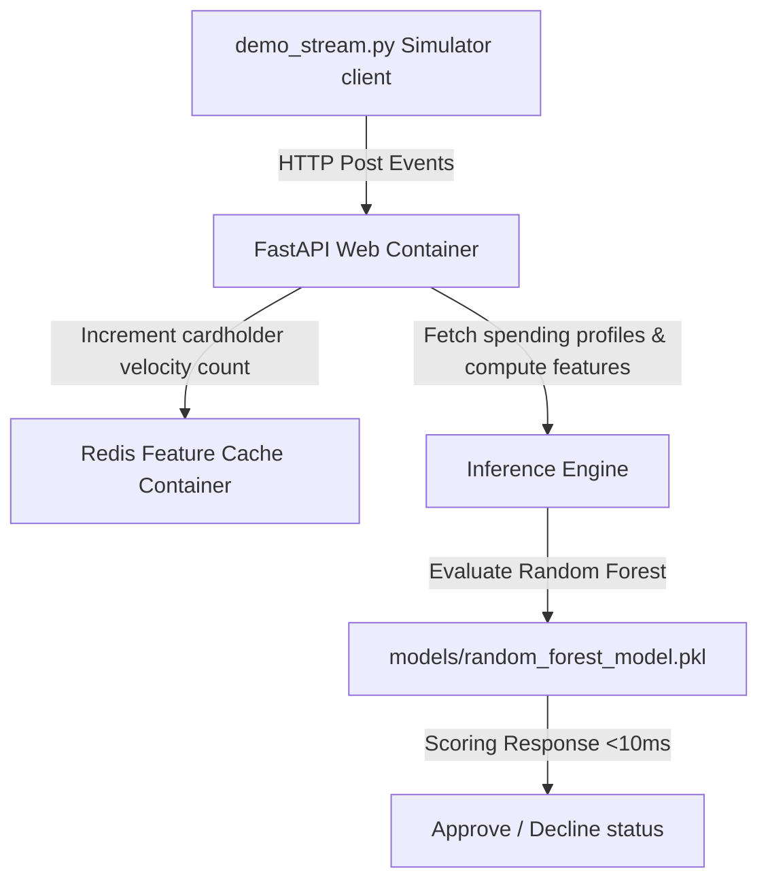

# Production-Grade Real-Time Credit Card Fraud Detection System

An industry-grade credit card fraud detection system designed to benchmark machine learning models and serve low-latency inferences under 10ms. This project demonstrates how data science feature engineering (solving temporal, spatial, and leakage-free data tracking) directly translates into robust MLOps microservices containerized with Docker and cached using Redis.

---

## 🏗️ System Architecture



---

## 📈 Modeling & Data Leakage Resolution

I trained and compared **Random Forest, XGBoost, and LightGBM** models across context-rich datasets.

### The Leakage Loophole & The Fix
When building rolling customer spend deviation statistics (`Amount / User Average Spend`), computing ratios globally leaks future target indicators from test splits into the training parameters, producing a false PR-AUC of `0.999`. 

* **My Resolution:** I refactored the split strategy—cardholder baseline averages are computed **strictly on the training split** and mapped onto test splits to guarantee chronological isolation. This yielded a realistic and highly robust **`0.93` PR-AUC** (Random Forest model).

### 🛠️ Production Engineering Highlights
To move this system beyond a sandbox demo, I implemented three key reliability and performance enhancements:
* **Active Rolling Windows & TTL Caching:** Redis velocity keys are configured with a 24-hour Time-to-Live (TTL) expiration window upon creation. This bounds memory usage to active cardholders, prevents memory leaks, and correctly measures rolling transaction frequency.
* **Deterministic Temporal Parsing:** Cylical time features (`hour_sin`, `hour_cos`, `day_of_week`) are extracted directly from the incoming event timestamp payload instead of the server system clock, protecting the model from network transmission delays or clock drift.
* **Graceful Redis Failover Resilience:** If the Redis cluster drops offline, the FastAPI service degrades gracefully—logging the error and falling back to default velocity averages to complete the prediction rather than failing with an `HTTP 500` error and blocking transaction pipelines.


---

## 📂 Repository Contents

* **`notebooks/fraud_model_comparison.ipynb`**
  * The main exploratory model comparison notebook showing metrics evaluation across RF, XGBoost, and LightGBM models, complete with PR-AUC graphs and data-leakage analysis cells.
* **`src/generator.py`**
  * Custom transaction simulator that acts as a real-time card swipe stream.
* **`src/save_model.py`**
  * Training script that fits the leakage-free Random Forest and serializes model objects to disk.
* **`src/app.py`**
  * FastAPI real-time microservice querying Redis to fetch and increment velocity metrics.
* **`src/demo_stream.py`**
  * Integration testing script streaming swipe events directly to the server.
* **`models/`**
  * Directory containing exported binaries: Random Forest model (`random_forest_model.pkl`), LabelEncoder (`label_encoder.pkl`), and cardholder spending profiles (`user_profiles.json`).
* **`Dockerfile` & `docker-compose.yml`**
  * Multi-container orchestration setting up the web app and database cache.

---

## 🚀 How to Run and Test the System

### Option A: Running Containerized (Recommended)
Orchestrate the FastAPI service and the Redis database cache inside Docker containers:
```bash
docker-compose up --build
```
Once the containers boot, you can access:
* The interactive API Swagger documentation: [http://localhost:8000/docs](http://localhost:8000/docs)
* The API health check: [http://localhost:8000/health](http://localhost:8000/health)

In a separate terminal window, start the local streaming client to feed transaction events to the server:
```bash
.\venv\Scripts\python src/demo_stream.py
```

### Option B: Running Locally (Without Docker)
1. Ensure you have a Redis service running locally (listening on port `6379`).
2. Start the FastAPI uvicorn server:
   ```bash
   .\venv\Scripts\python -m uvicorn src.app:app --reload --port 8000
   ```
3. Start the stream simulator:
   ```bash
   .\venv\Scripts\python src/demo_stream.py
   ```
