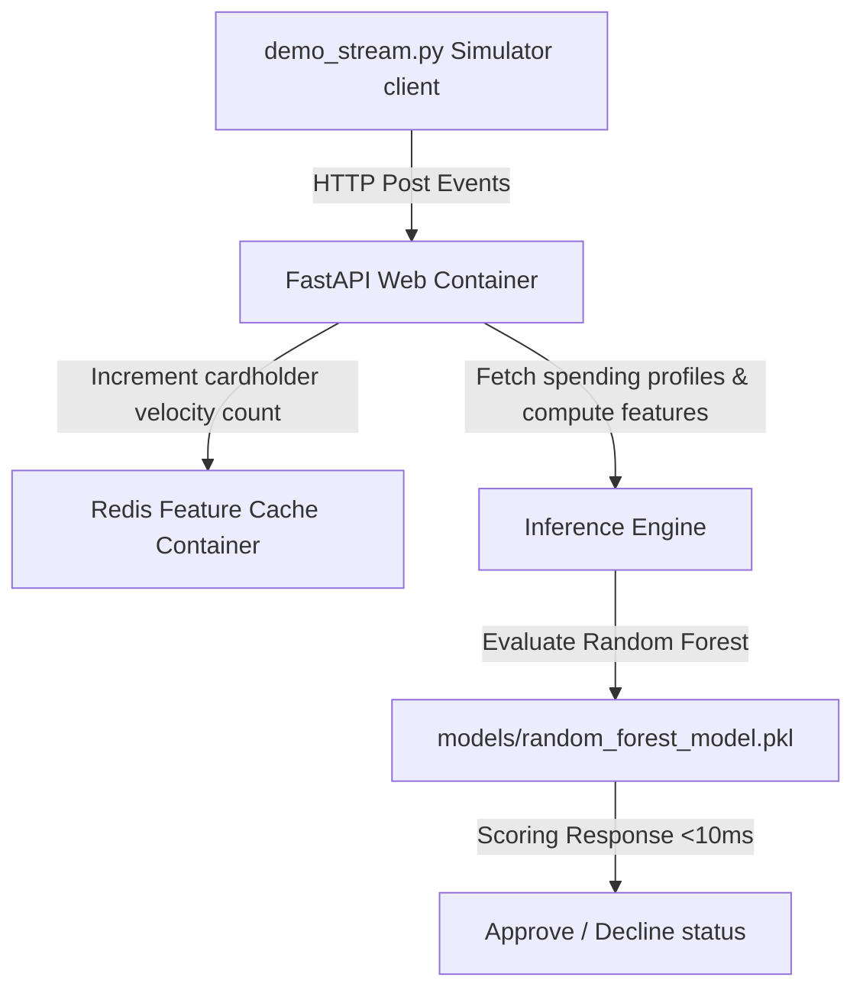

# Production-Grade Real-Time Credit Card Fraud Detection System

An industry-grade credit card fraud detection system designed to benchmark machine learning models and serve low-latency inferences under 10ms. This project demonstrates how data science feature engineering (solving temporal, spatial, and leakage-free data tracking) directly translates into robust MLOps microservices containerized with Docker and cached using Redis.

---

## 🏗️ System Architecture



---

## 🧠 Engineering Thought Process & Implementation Steps

To build a robust, real-time machine learning system, the implementation followed a structured progression from exploratory analysis to production deployment:

### Step 1: Historical Data Exploration & Model Comparison
* **Objective:** Identify the optimal classifier configuration to balance inference latency with model reliability.
* **Process:** Conducted benchmark training runs comparing **Random Forest, XGBoost, and LightGBM** models using the historical dataset ([fraud_model_comparison.ipynb](file:///D:/SideProject/FraudCreditCardDectector/notebooks/fraud_model_comparison.ipynb)).
* **Outcome:** The Random Forest Classifier was selected as the champion model. It achieved superior predictive performance and stable inference characteristics suitable for low-latency lookups.

### Step 2: Identification & Resolution of Data Leakage
* **Problem:** Rolling customer spend metrics (e.g., `Amount / User Average Spend`) computed globally leak future target indicators into training parameters. This resulted in an artificially inflated, unrealistic validation PR-AUC of `0.999`.
* **The Fix:** Refactored the data splitting strategy within [save_model.py](file:///D:/SideProject/FraudCreditCardDectector/src/save_model.py). Historical spend profiles (`user_profiles.json`) are compiled **strictly from the training split**. These computed training baselines are then mapped onto test distributions, ensuring complete chronological isolation.
* **Result:** Achieved a realistic and production-stable **`0.93` PR-AUC** under strict leakage-free conditions.

### Step 3: Architecture Selection & Production Feature Store Design
* **Objective:** Enable sub-10ms latency for feature computation and inference during active swiping events.
* **Solution:** 
  * **Redis Feature Store:** Selected Redis to store transient, stateful rolling transaction velocity fields. This avoids database overhead and handles high concurrency.
  * **24-Hour Sliding Expiration (TTL):** Velocity counters expire automatically after 24 hours to prevent memory leaks and maintain active-only user records.
  * **Stateless REST Layer:** Implemented the API using FastAPI to benefit from asynchronous requests and keep microservices lightweight.

### Step 4: Resilient Edge-Case Engineering
* **Redis Outage Graceful Degradation:** Modified the scoring logic in [app.py](file:///D:/SideProject/FraudCreditCardDectector/src/app.py) to wrap Redis operations in try-except blocks. If the Redis server drops offline, the FastAPI service logs the error and gracefully falls back to default velocity averages (`user_tx_count = 1`) instead of failing with an `HTTP 500` error.
* **Time Drift & Clock Sync Isolation:** Cyclical time coordinates (`hour_sin`, `hour_cos`, `day_of_week`) are derived deterministically from the payload’s timestamp rather than the serving machine's local clock. This shields the pipeline from network delays and container system clock discrepancies.

### Step 5: Containerized Orchestration & End-to-End Testing
* Created a multi-container environment via `docker-compose.yml` hosting:
  * **`web`**: Runs the FastAPI app (`app.py`) inside a lightweight Python environment.
  * **`redis`**: Instantiates a memory-cached instance acting as the real-time feature store.
* Developed a transaction event simulator ([demo_stream.py](file:///D:/SideProject/FraudCreditCardDectector/src/demo_stream.py)) that feeds transaction streams into the running microservices to validate end-to-end integration and measure latency under load.

---

## 📂 Repository Contents

* **`notebooks/fraud_model_comparison.ipynb`**
  * The main exploratory model comparison notebook showing metrics evaluation across RF, XGBoost, and LightGBM models, complete with PR-AUC graphs and data-leakage analysis cells.
* **`src/generator.py`**
  * Custom transaction simulator that acts as a real-time card swipe stream.
* **`src/save_model.py`**
  * Training script that fits the leakage-free Random Forest and serializes model objects to disk.
* **`src/app.py`**
  * FastAPI real-time microservice querying Redis to fetch and increment velocity metrics.
* **`src/demo_stream.py`**
  * Integration testing script streaming swipe events directly to the server.
* **`models/`**
  * Directory containing exported binaries: Random Forest model (`random_forest_model.pkl`), LabelEncoder (`label_encoder.pkl`), and cardholder spending profiles (`user_profiles.json`).
* **`Dockerfile` & `docker-compose.yml`**
  * Multi-container orchestration setting up the web app and database cache.


---

## 🚀 How to Run and Test the System

### Option A: Running Containerized (Recommended)
Orchestrate the FastAPI service and the Redis database cache inside Docker containers:
```bash
docker-compose up --build
```
Once the containers boot, you can access:
* The interactive API Swagger documentation: [http://localhost:8000/docs](http://localhost:8000/docs)
* The API health check: [http://localhost:8000/health](http://localhost:8000/health)

In a separate terminal window, start the local streaming client to feed transaction events to the server:
```bash
.\venv\Scripts\python src/demo_stream.py
```

### Option B: Running Locally (Without Docker)
1. Ensure you have a Redis service running locally (listening on port `6379`).
2. Start the FastAPI uvicorn server:
   ```bash
   .\venv\Scripts\python -m uvicorn src.app:app --reload --port 8000
   ```
3. Start the stream simulator:
   ```bash
   .\venv\Scripts\python src/demo_stream.py
   ```
